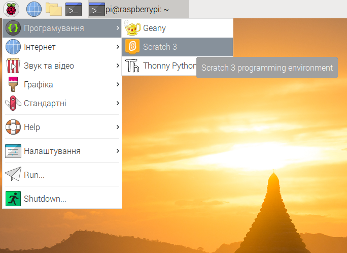
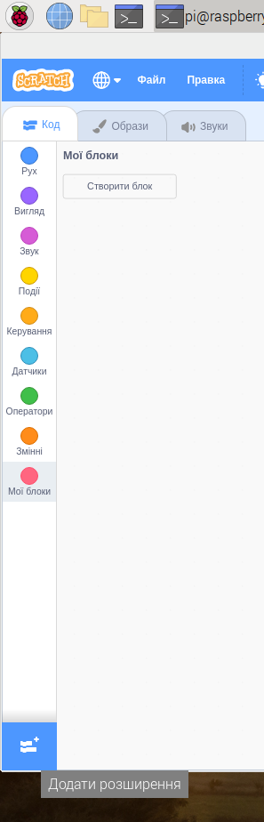
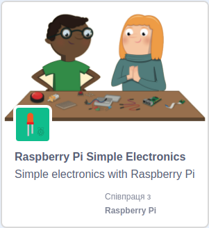

## Перевір своє електричне коло в Скретч

Тепер, щоб створити програму для керування світлодіодом, ти поєднаєш електричне коло та перший колір веселки із Скретч.

\--- task \--- Відкрий Скретч 3 на Raspberry Pi.

 \--- /task \---

\--- task \--- Далі додай розширення Raspberry Pi Simple Electronics



 \--- /task \---

\--- task \--- На попередньому кроці ти під’єднав (-ла) свій світлодіод до піна **3V3**. Це саме той пін, який треба використовувати для тестування світлодіодів. Зараз тобі треба приєднати свій світлодіод до піна, яким можна керувати в Скретч. Перестав перемичку з піна **3V3** на новий пін, скажімо **GPIO 17**. \--- /task \---


\--- task \--- Тепер перевір, що світлодіодом можна керувати за допомогою наступного простого скрипта

```blocks3
when flag clicked
turn LED (17 v) [on v] ::extension
wait (1) secs
turn LED (17 v) [off v] ::extension
```

\--- /task \---

\--- task \--- Клацни на зелений прапор, щоб запустити свій скрипт. Світлодіод повинен загорітися на 1 секунду. \--- /task \---