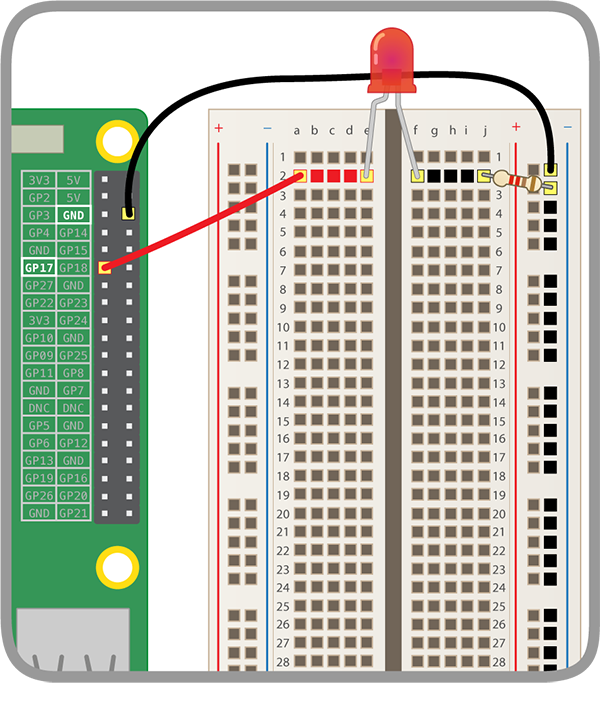

## Створи свою веселку

На цьому кроці ти збереш веселку і запрограмуєш її світлодіоди блимати відповідним чином.

--- task --- Збери всі світлодіоди, які ти плануєш використовувати, і переконайся, що в тебе є необхідна кількість перемичок та резисторів (по одному на кожен світлодіод). --- /task ---

--- task --- Перебудуй існуюче електричне коло, щоб звільнити місце для інших кольорів веселки. --- /task ---

### Заземлення веселки

--- task --- Для того, щоб твоя веселка яскраво сяяла і не була закрита великою кількістю перемичок, всі світлодіоди мають використувувати єдиний пін **Заземлення (GND)**. Ти можеш розмістити їх таким чином, трохи переставивши компоненти на макетній платі.

Всередині плата виглядає так:

Для того, щоб заземлити всю веселку за допомогою єдиної перемички: --- /task ---

--- task --- З’єднай перемичку, прикріплену до **GND** з **шиною** на макетній платі. --- /task ---

--- task --- Переконайся, що резистори приєднуються до тієї ж шини, що й перемичка з **GND**, та до того ж **рядка**, що й світлодіоди, до яких вони відносяться: --- /task ---

### Заверши веселку

--- task --- Додай решту світлодіодів, перемичок та резисторів до макетної плати з бажаним порядком кольорів. Не забудь залишити місце для кнопки внизу. --- /task ---

Якщо ти використовуєш багато різних кольорів, тоді буде зручно використовувати кольори перемичок, що відповідають твоїм світлодіодам.

Твоя веселка має виглядати якось так:

