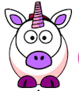
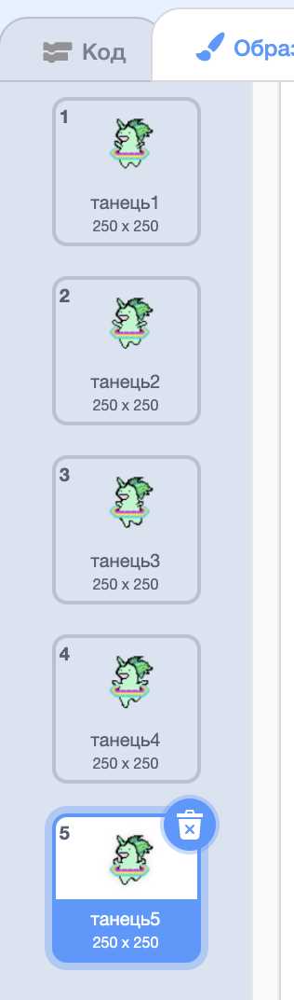

## Створи єдинорога, що танцює в ритмі твоєї веселки

На цьому кроці ти створиш єдинорога в Скретч, що танцює в ритмі веселки. Ти будеш використовувати кнопку, щоб запрограмувати веселку та єдинорога.

### Спрайт єдинорога

Вибери одну з наступних можливостей для створення спрайта єдинорога:

1. Використай спрайт єдинорога зі Скретч
2. Знайди зображення єдинорога деінде і завантаж як власний спрайт
3. Намалюй власний спрайт єдинорога в Скретч або в іншій програмі (як-от чудовий зелений єдиноріг справа).

Приклади:

|              (1) Спрайт зі Скретч:               |             (2) Твоє завантаження:             |              (3) Власний малюнок:               |
|:------------------------------------------------:|:----------------------------------------------:|:-----------------------------------------------:|
|  |  |  |

--- task --- Якщо ти вибрав (-ла) варіант 1, клацни сюди: 
[[[generic-scratch3-sprite-from-library]]] 
--- /task ---

--- task --- Якщо ти вибрав (-ла) варіант 2, бо хочеш завантажити зображення єдинорога, знайдене деінде, спочатку клацни нижче, щоб дізнатися про пошук зображень, які дозволено використовувати, а далі використовуй інструкції з другого блоку для завантаження твого файлу: 
[[[images-permissions-to-use]]]

[[[generic-scratch3-sprite-from-library]]] 
--- /task ---

--- task --- Якщо ти вибираєш варіант 3, клацни нижче, щоб знайти інструкції про те, як намалювати власного єдинорога в Скретч: 
[[[generic-scratch3-draw-sprite]]] 
--- /task ---

### Образи єдинорога

Щоб твій єдиноріг міг танцювати, йому потрібні **образи**. Образ — це одне із багатьох візуальних представлень спрайта, тобто спрайти можуть змінювати свій вигляд, змінюючи образи. Таким чином, коли ти хочеш створити анімацію, ти можеш використовувати образи, щоб виглядало так, ніби спрайт рухається.

В даному випадку ми створюватимемо анімацію танцюючого єдинорога, тому кожен образ буде показувати якийсь його танцювальний рух.

--- task --- Подумай скільки образів потрібно твоєму єдинорогу для танцю і відредагуй образи відповідним чином.

Клацни для нагадування як додавати образи в Скретч: 
[[[generic-scratch3-add-costume]]]

Клацни для нагадування як дублювати образи в Скретч: 
[[[generic-scratch3-duplicate-costumes]]] 
--- /task ---

Скільки образів додавати залежить тільки від тебе. Для цього танцюючого зеленого єдинорога у нас є п’ять образів:

|  |  |

### Танець єдинорога

Для створення анімації танцю тобі треба запрограмувати зміну образів єдинорога.

--- task --- Перемкнися між першими двома образами для початку танця єдинорога.

Для перемикання з першого на другий образ використай:

```blocks3
switch costume to [costume 2 v]
```

Взагалі єдинороги є хорошими танцюристами, тому переконайся, що танець твого єдинорога відповідає ритму веселки. Ти можеш використовувати блок `чекати`{:class="blockcontrol"}, щоб привести до відовідності паузи веселки та єдинорога.

```blocks3
wait (0.5) secs
switch costume to [costume 2 v]
```

--- /task ---

--- task --- Для створення танцюючого єдинорога перемикайся між усіма костюмами без зупинки. Який тип циклу тобі для цього потрібен? --- /task ---

--- hints ---
 --- hint ---

Використай цикл "завжди":

```blocks3
forever
```

--- /hint --- --- hint ---

Використай наступний блок для перемикання на наступний образ на кожному кроці циклу:

```blocks3
next costume
```

--- /hint --- --- hint ---

Твій код має виглядати якось так:

```blocks3
forever
wait (0.5) secs
next costume
```

--- /hint ------ /hints ---