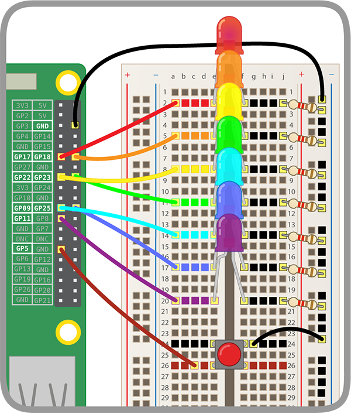

## Додай кнопку

А зараз ти зробиш, щоб веселка блимала, а єдиноріг танцював в ритм, за натисканням кнопки!

### Приєднай кнопку

--- task --- Приєднай кнопку до макетної плати та GPIO-піна.

Клацни нижче, щоб переглянути інструкції про те, як приєднати кнопку до Raspberry Pi. Зверни увагу, що замість **GPIO 17** як сказано в інструкції, ми будемо використовувати для кнопки **GPIO 5**, бо **GPIO 17** вже зайнятий світлодіодом.

[[[rpi-gpio-wiring-a-button]]]

Тепер твоя веселка має виглядати приблизно так:

 --- /task ---

### Код для кнопки

--- task --- Використовуй блок, наведений нижче, щоб кнопка запускала танець єдинорога.

```blocks3
when button (5 v) is [pressed v] :: hat extension
```

--- /task ---

### Керуй танцем єдинорога

Наразі в тебе має бути три фрагменти коду на Скретч:

1. Код для танцюючого єдинорога
2. Код для блимаючої веселки
3. Код для кнопки

Зараз ти їх поєднаєш, щоб твій єдинорог танцював в ритмі веселки, і щоб ти міг керувати веселкою та єдинорогом шляхом натискання кнопки, яку ти додав (-ла).

--- task --- Видали всі блоки `говорити`{:class="block3looks"} в коді кнопки і продублюй цей фрагмент коду. --- /task ---

--- task --- В коді для танцю єдинорога видали блок `коли ⚑ натиснуто`{:class="block3events"}. Візьми решту коду єдинорога і встав його в блок `інакше`{:class="block3control"} коду кнопки. Встав його тільки в **одну копію** коду кнопки. --- /task ---

--- task --- В коді для веселки видали блок `коли ⚑ натиснуто`{:class="block3events"} і встав решту коду веселки в блок `інакше`{:class="block3control"} **іншої копії** коду кнопки. --- /task ---

--- task --- Додай якусь дію в блок `якщо`{:class="block3control"} обох копію коду кнопки. Ти можеш використовувати `змінити образ на перший`{:class="block3looks"} щоб єдиноріг не переплутав танцювальні рухи. --- /task ---

--- hints ---
 --- hint --- Якщо натискання кнопки не засвітило веселку і єдиноріг не почав танцювати в її ритм, перевір що:

1. Кожен компонент приєднано до правильного GPIO-pinа
2. В коді ти правильно використовуєш вводи та виводи
3. Затримки для обох фрагментів коду відповідають одна одній
4. Ти використав (-ла) всі правильні блоки коду

--- /hint ---
--- /hints ---