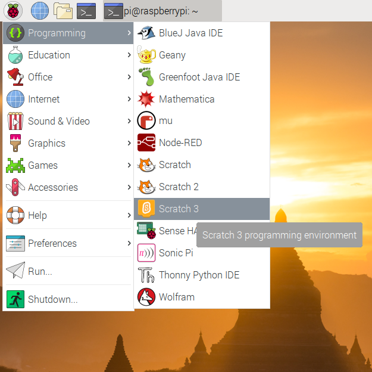
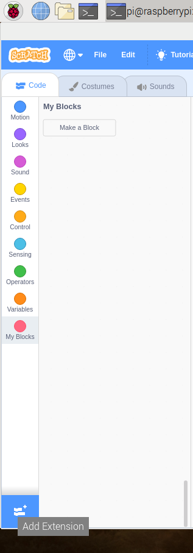

## 在Scratch中测试电路

现在将把电路和第一个颜色连接到Scratch，这样您就可以编辑一个 Scratch 程序来控制LED。

\--- task \--- 在Raspberry Pi上打开Scratch 3。

 \--- /task \---

然后添加Raspberry Pi Simple Electronics扩展模块



 \--- /task \---

\--- task \--- 在上一步中，将LED连接到了引脚**3V3**， 3V3是用来测试的引脚。 现在，您需要将LED连接到可以通过Scratch控制的引脚。 将导线从引脚** 3V3**换到一个新引脚，例如** GPIO 17 ** 。 \--- /task \---


\--- task \--- 测试您可否使用以下简单指令控制LED

```blocks3
when flag clicked
turn LED (17 v) [on v] ::extension
wait (1) secs
turn LED (17 v) [off v] ::extension
```

\--- /task \---

单击绿旗测试你的指令。 LED应该会亮1秒钟。 \--- /task \---