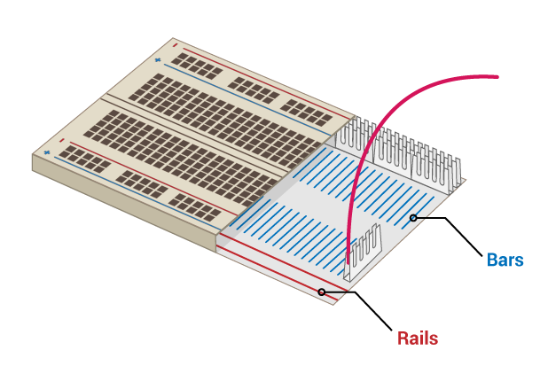

## 构建彩虹

在此步骤中，组装你自己的彩虹并对构成彩虹的LED灯进行编程，让它们可以像彩虹一样闪烁。

准备LED灯以及相应数量的跳线和电阻器 (每个LED 一条跳线和ㄧ个电阻器)。 \--- /task \---

\--- task \--- 重新布置已有的电路，为彩虹的其他颜色腾出空间。 \--- /task \---

### 连接地线

\--- task \--- 想让彩虹正常闪烁并且不被太多的跳线覆盖，所有LED应该共享一个** Ground (GND) **引脚。 你可以重新排列在面板上的电子元件将它们设置成这样。

面板的内部是这个样子的：

用一根跳线将整个彩虹接地： \--- /task \---

\--- task \--- 将连接到**GND**的跳线链接到面板的**rail** \--- /task \---

\--- task \--- 同时要保证电阻与** GND**跳线连接到同一轨，并且与对应的LED连接到同一栏**bar**： \---/task \---

### 完成彩虹组装

\--- task \--- 将剩余的LED灯、跳线和电阻按照你的设想连接到面板上。 别忘了在最后给按钮留个位置。 \--- /task \---

如果你用的颜色比较多，那么将LED灯和跳线的颜色搭配一致操作起来会更加方便。

你的彩虹看起来应该差不多是这个样子：

