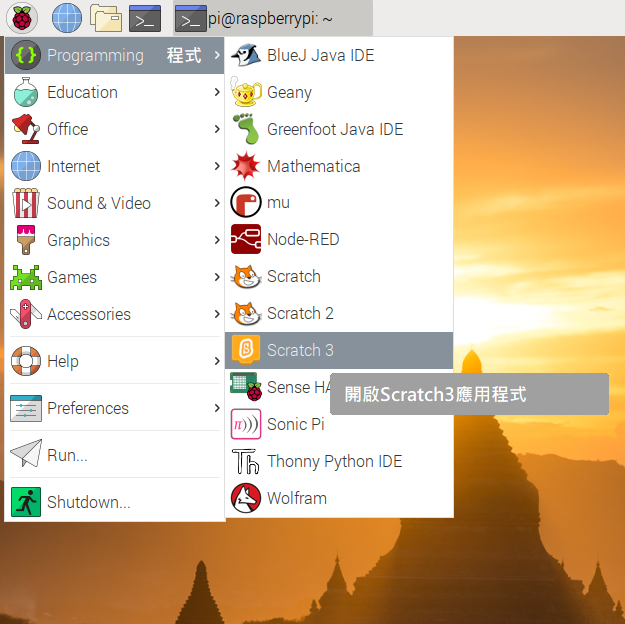
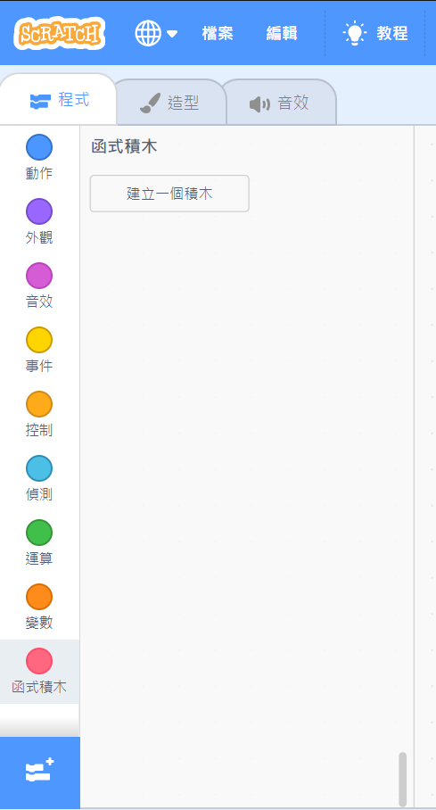

## 在Scrach裡測試你的電路

現在你可以將彩虹的第一道顏色連接到Scratch，之後你便可以編寫Scratch程序來控制LED。

--- task --- 在Raspberry Pi上打開Scratch 3應用程式

 --- /task ---

--- task --- 然後添加Raspberry Pi Simple Electronics擴展套件



 --- /task ---

--- task --- 在上一步中，你已經將LED與針腳 **3V3**連接。 這是一個可以讓你測試LED的針腳。 現在你要將LED與Scratch用針腳連接，這樣你就能用Scratch控制你的LED。 將導線從針腳**3V3**移動到新針腳，例如 **GPIO 17** 。 --- /task ---


--- task --- 現在測試看看可不可以用以下簡單的程序控制LED。

```blocks3
when flag clicked
turn LED (17 v) [on v] ::extension
wait (1) secs
turn LED (17 v) [off v] ::extension
```

--- /task ---

--- task --- 單擊綠色旗幟來跑程式。 LED會亮1秒鐘。 --- /task ---