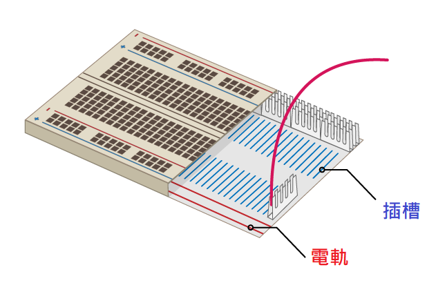

## 建造你的彩虹

在此步驟中，你將組裝你的彩虹並對其LED來編寫程式，使其以彩虹模式閃爍。

\---task\--- 找到你將要使用的所有LED，並確保你有正確數量的跳線和電阻器（每個LED一個）。 \--- /task \---

\---Task\--- 調整電路，以便為彩虹的其他顏色騰出空間。 \--- /task \---

### 將彩虹接地

\---task\--- 為了使你的彩虹大大地發光並且不被太多的跳線掩埋，所有LED應當共享一個** 接地(GND） **針腳。 你可以像這樣在麵包板上重新設置你的組件。

麵包板內部看起來像這樣：

用一條跳線將整個彩虹接地： \--- /task \---

\---task\--- 將連接到** GND **的跳線連接到麵包版的**電軌** \--- /task\---

\---task\--- 確保電阻器與** GND**跳線連接到同一電軌，並連接到LED所屬的**插槽**： \--- /task \---

### 完成彩虹

\---task\--- 將其餘的LED，跳線和電阻添加到麵包板上，依照成你選擇的顏色安排。 最後記得留出一個按鈕的空間。 \--- /task \---

如果你使用許多不同的顏色，使跳線的顏色與您的LED燈相同可能會有幫助。

你的彩虹應該看起來像這樣：

